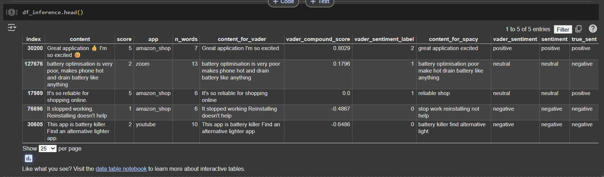

# Sentiment Analysis (English Google Play Reviews) — Weak Supervision (VADER)
**Dicoding Machine Learning Bootcamp 2025 — Portfolio Project**

Sentiment analysis on English Google Play reviews (VADER pseudo-labels) with TF-IDF + LinearSVC (Macro F1 0.84).

## Overview
This project builds a 3-class sentiment classifier for **English Google Play Store reviews**:
- **negative**, **neutral**, **positive**

Labels are generated using **VADER** as **weak supervision (pseudo-labels)**. The focus is on a reproducible pipeline and evaluation using **Macro F1**.

## Goal
- Build an end-to-end NLP workflow: data collection, preprocessing, weak labeling, training, and evaluation.
- Establish a strong classical baseline and document limitations of weak supervision.

## Data
- **Source:** English Google Play Store reviews (scraped using `google-play-scraper`).
- **Apps / categories (6 apps):**
  - Facebook (`com.facebook.katana`) — Social media
  - Uber (`com.ubercab`) — Ride-hailing / transportation
  - YouTube (`com.google.android.youtube`) — Video platform
  - Zoom (`us.zoom.videomeetings`) — Video conferencing
  - Twitter/X (`com.twitter.android`) — Microblogging / public discussion
  - Amazon Shopping (`com.amazon.mShop.android.shopping`) — E-commerce
- **Total raw rows:** ~133,420
- **Test set size:** **25,331**

## Labeling (Weak Supervision)
- **Method:** VADER compound scores mapped to 3 classes (neg/neu/pos)
- **Known limitation:** pseudo-labels contain noise and may not match human ground truth in domain-specific cases.

## Approach
### Preprocessing
- Scraping: collected English reviews via `google-play-scraper` (`reviews_all`) with `lang='en'`, `country='us'`, `sort=MOST_RELEVANT`, max `count=500000` per app; removed empty reviews and de-duplicated by `content`.
- Template filtering: removed common templated replies (e.g., “thank you for…”, “contact our support…”) to reduce non-user noise.
- VADER-ready text (`content_for_vader`): HTML tag removal; HTML entity unescape; Unicode normalization (NFKD); removed URLs/mentions/hashtags; removed emojis (demojize → strip); kept alphanumeric + apostrophes (for contractions); whitespace normalization (**no lowercasing** to preserve VADER signals).
- ML-ready text (`content_for_spacy`): SpaCy-based cleaning on top of `content_for_vader`: lowercasing + lemmatization; removed stopwords (NLTK) while **keeping negations**; kept alphabetic tokens only; added custom stopwords (e.g., app names and generic words) to reduce domain-specific noise.

## Experiment Setup
- Train/val split: 95% (train/val), inference holdout: 5%
- Sequence length: MAX_LEN=22 (P95 of review length)
- DistilBERT: batch=16, epochs=3 (GPU T4 in Colab)

### Models
This project compares three approaches for 3-class sentiment classification (negative/neutral/positive):

- **TF-IDF + LinearSVC (baseline):** strong classical baseline for short reviews; tuned with GridSearchCV (class_weight='balanced').
- **FastText (pretrained) + BiLSTM:** sequence model with pretrained embeddings (300d); handles morphology and context; uses class weights to address imbalance.
- **DistilBERT (transfer learning):** fine-tuned `distilbert-base-uncased` for 3 epochs; best overall performance in this study.

## Results
Evaluation on a held-out split (test size: **25,331**):

| Model | Accuracy | Macro F1 | Notes |
|---|---:|---:|---|
| TF-IDF + LinearSVC | 0.857 | ~0.85 | Fast, strong baseline |
| FastText + BiLSTM | 0.957 | 0.953 | Better contextual modeling |
| DistilBERT | 0.966 | 0.963 | Best overall |

**Selected deployment candidate:** DistilBERT (best Macro F1 and accuracy).

## Artifacts
### Inference / Evaluation Snapshot
Screenshot of the inference/evaluation output.

## How to Run
### Environment
- Python: 3.10
- Core libs: pandas, scikit-learn, vaderSentiment, matplotlib

### Run via Notebook (recommended for this repo)
1. Run `Scraping-Preprocessing.ipynb` to collect/clean data.
2. Run `Modelling.ipynb` to train/evaluate models and generate artifacts.

## Limitations & Notes
- An additional inference sanity-check mapped Play Store star ratings (1–2/3/4–5) to sentiment labels as a **proxy**, not ground truth. Performance against this proxy was lower (Accuracy 0.61, Macro F1 0.518) and should not be treated as true model accuracy.
- Since weak supervision is used (VADER pseudo-labels), a small gold-labeled set is recommended for unbiased evaluation.

## Links
- Scraping & Preprocessing notebook: [Scraping-Preprocessing.ipynb](Scraping-Preprocessing.ipynb)
- Modelling notebook: [Modelling.ipynb](Modelling.ipynb)
- Artifacts (results): [results/](results/)
- Repository (portfolio folder): [sentiment-analysis-app-review](./)
